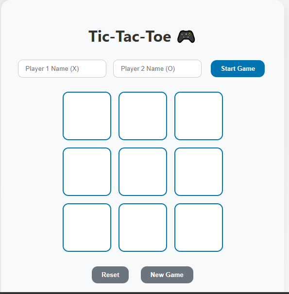
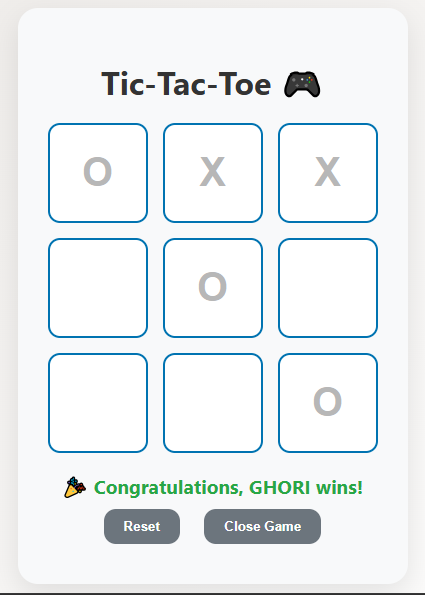

# 🎮 Tic Tac Toe Game

A simple Tic Tac Toe game built using HTML, CSS, and JavaScript (ES6).

## 📸 Previews




## 🔗 Live Demo
[🎮 Play Live Game]( https://kg-se.github.io/tic-tac-toe_game/)

## 🚀 Features
- Start/close game functionality
- Two-player mode
- Dynamic player names
- Winner detection
- Draw handling
- Clean UI

## 🛠️ Technologies Used
- HTML
- CSS
- JavaScript (ES6)

## 📁 Project Structure
```bash
index.html
style.css
script.js
screenshots/
```

## 👨‍💻 Author
🔗**Kashan Ghori
https://github.com/KG-SE

This projects helped me improved my concepts of JavaScript (ES6) & skills of frontend development.
