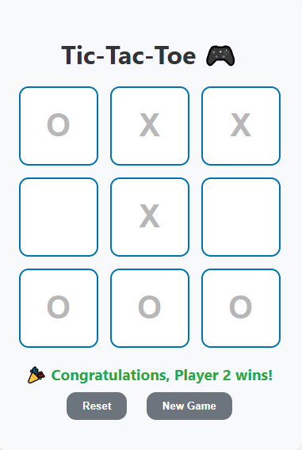

# 🎮 Tic Tac Toe Game

A simple Tic Tac Toe game built using HTML, CSS, and JavaScript.

## 📸 Preview


## 🔗 Live Demo
[🎮 Play Live Game](https://kg-se.github.io/tic-tac-toe_game/)

## 🚀 Features
- Two-player mode
- Dynamic player names
- Winner detection
- Draw handling
- Clean UI

## 🛠️ Technologies Used
- HTML
- CSS
- JavaScript

## 📸 Screenshot

### 🟢 Play Game Screen


## 📁 Project Structure
```bash
index.html
style.css
script.js
screenshots/
```

## 👨‍💻 Author
Kashan Ghori
https://github.com/KG-SE
